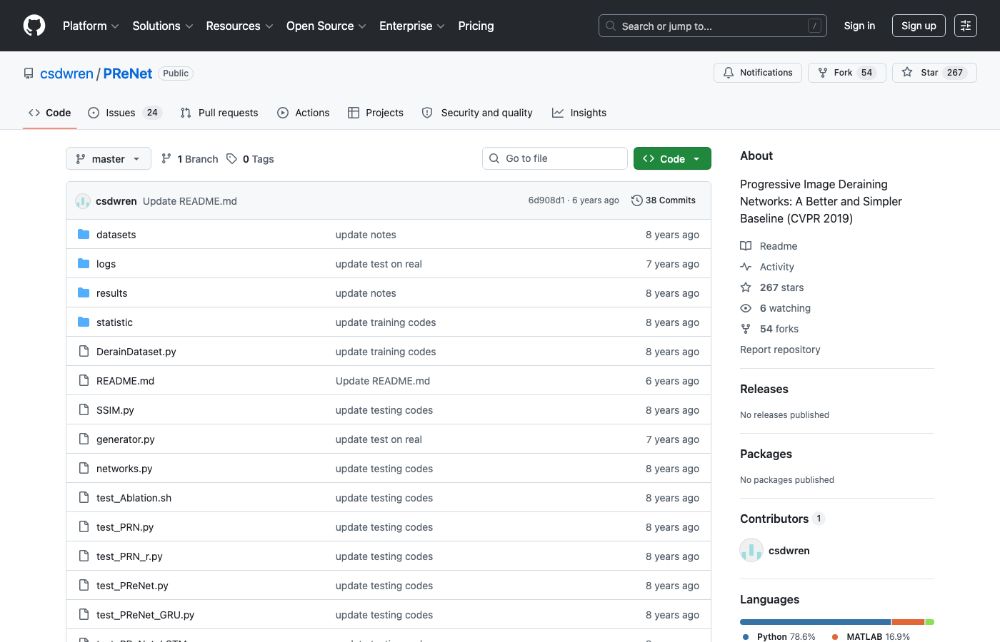

# Derain API

Archived deraining API note repository. This repo is kept as a small historical entry for early single-image rain-removal API experiments and points to the more complete deraining UI / restoration research work.

<p align="center">
  
</p>

> Preview image source: the public PReNet repository at https://github.com/csdwren/PReNet.

## Context

Single-image deraining APIs usually wrap three layers:

1. image upload / decoding
2. restoration model inference
3. response encoding and visualization

This repository started as an early API placeholder. For a runnable local deraining demo, see the related `derainUI` repository.

## Related Work

- PReNet: https://github.com/csdwren/PReNet
- Progressive Image Deraining Networks: A Better and Simpler Baseline: https://ieeexplore.ieee.org/document/8953349/

## Current Files

```text
111.md      historical placeholder note
assets/     public preview image used by this README
```

## Status

This repository is intentionally minimal and preserved for account/project history. New development should happen in a maintained deraining demo or research-code repository.
